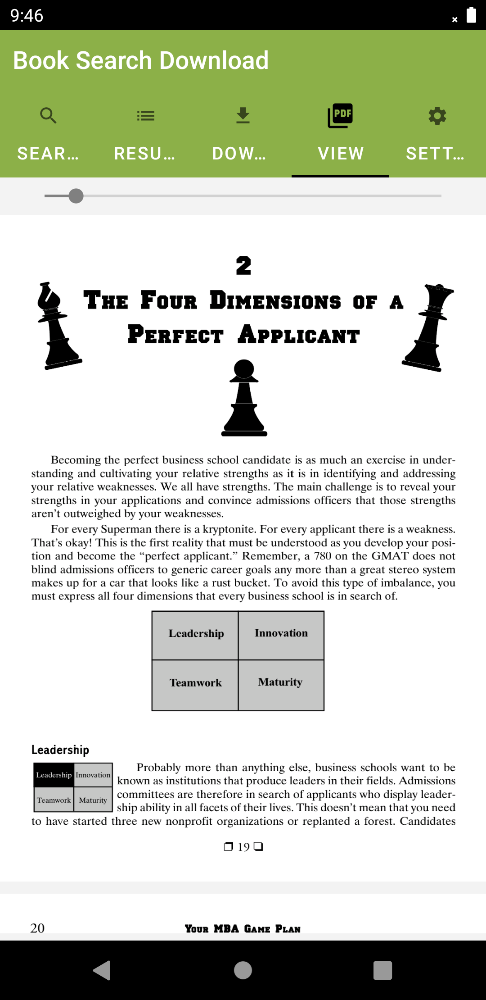
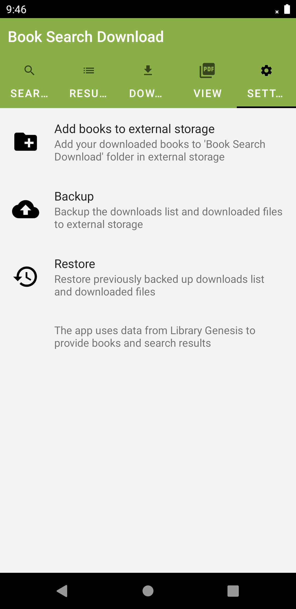
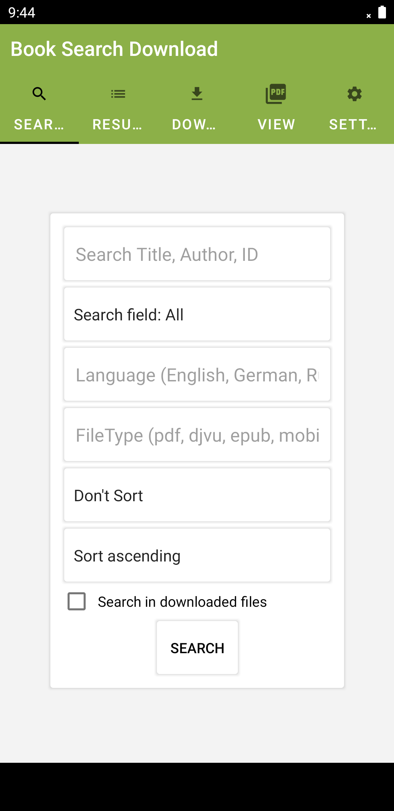

## BookSearchDownload - Android App

An Android app created by me, available on PlayStore.  
https://play.google.com/store/apps/details?id=com.threethree.booksearchdownload  

* The App Scrapes the libgen website to provide pdf, djvu, epub, and other files.  
* Runs Foreground service to download these files.  
* App contains 7 Fragments (Search, Results, Downloads, Settings, Pdf reader, Djvu reader, Epub reader).  
* Maintains history of downloads using SharedPreferences.  
* Renders and displays Djvu files using native "DJVUlibre" library.  
* Renders and displays Pdf files using native "Chromium's PDFium" library.  
* Displays Epub files by Unzipping and loading spine data.  
* Can Backup and Restore downloads list and files using Gson and SharedPreferences.  
* Has Google Admobs and Analytics.  

`Tools: Java, Kotlin, Android Studio, PDFium, DJVUlibre, Admob, Volley, Jsoup,
AWS S3, Gson`  

## Issues fixed

* Admob crashing due to many threads requesting it at same time
  * This happens because admob is initially requested with default configuration
  * When new configuration is downloaded from S3 bucket, admob is requested again
  * Also admob is requested again with latest configuration whenever network state changes
  * All of these requests run on seperate threads sometimes at overlapping times competing for same resource
  * Fixed by allowing only latest thread to request admob resource and block all other threads
  
* Deleting a download requires changing order of all later downloads in sharedprefs
  * This is expensive as it can cause UI delay
  * Fixed by not deleting at the moment, but marking the download as 'to be deleted'
    * Recycler view adapter needs to ignore these downloads, so give it a true position
    * When the app is opened next time, all the 'to be deleted' downloads are actually deleted  

## Phone Screenshots

