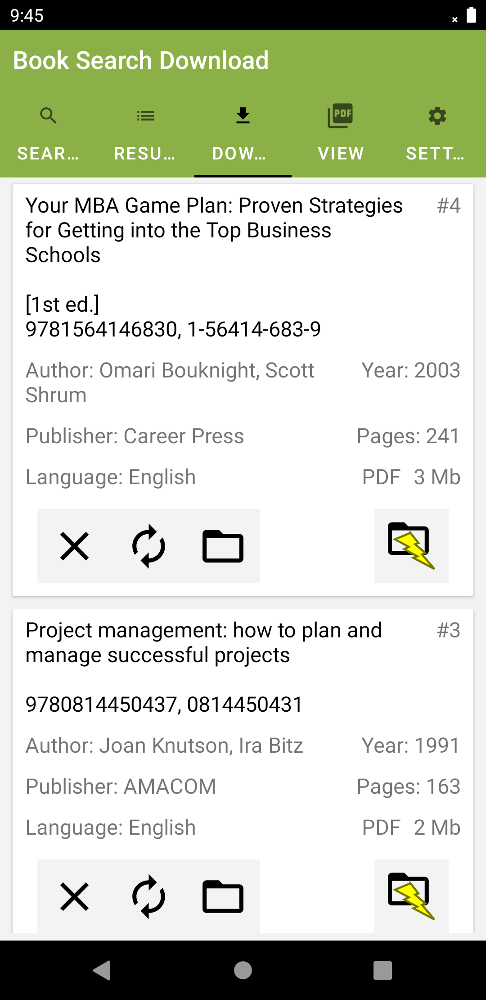

## BookSearchDownload

An Android app created by me, available on PlayStore.  
https://play.google.com/store/apps/details?id=com.threethree.booksearchdownload  

* The App Scrapes the libgen website to provide pdf, djvu, epub, and other files.  
* Runs Foreground service to download these files.  
* App contains 7 Fragments (Search, Results, Downloads, Settings, Pdf reader, Djvu reader, Epub reader).  
* Maintains history of downloads using SharedPreferences.  
* Renders and displays Djvu files using native "DJVUlibre" library.  
* Renders and displays Pdf files using native "Chromium's PDFium" library.  
* Displays Epub files by Unzipping and loading spine data.  
* Can Backup and Restore downloads list and files using Gson and SharedPreferences.  
* Has Google Admobs and Analytics.  

`Tools: Java, Kotlin, Android Studio, PDFium, DJVUlibre, Admob, Volley, Jsoup,
AWS S3, Gson`  

